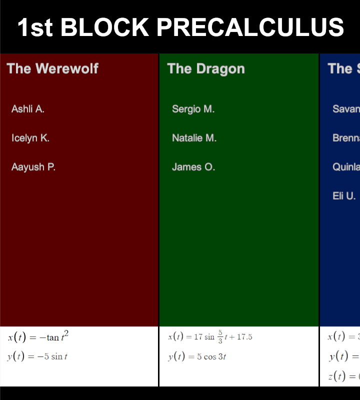

# Precalculus Lab - Designing a Video Game Using Parametric Equations

In this lab, students get hands-on, real-world experience with parametric equations
by designing a video game. In this repository is a simple base game that features a
player-controlled character whose goal is to move to the finish line while dodging
a fixed number of moving obstacles. The students' task is to write parametric equations
that specify the _x_ and _y_ coordinates of each obstacle, in a plane parallel to the
ground, as a function of time. Students break up into groups of 2 to 4, and each
group is responsible for the parameterization of one obstacle.

# Teacher Use

Making use of this project requires basic knowledge in C# programming and the Unity
game engine. Here's how the lesson goes at a high level:

0. From prior lessons, students should have a very basic understanding of
   parametric equations as a way of representing motion over time. In the first
   part of the lesson (~5 minutes), I gave students some useful parametric
   equations for periodic motion. Maybe have a class discussion about why using
   periodic motion for the obstacles would be a good idea (e.g., the obstacles
   move but stay on the field, the player can become better at the game by
   learning the motion of the obstacle, etc.).
1. Students then break out into at most six groups of two to four students. Each group
   decides on an obstacle color (red, green, blue, yellow, orange, or purple).
2. **Desmos:** Students begin designing their group's obstacle's pair of parametric equations
   using a [Desmos utility](https://www.desmos.com/calculator/sfgrffqxp2)
   custom-designed for this lesson (for more on this, see the Desmos section). The color
   in the Desmos utility matches the color of the obstacle in Unity for all obstacles
   except the yellow obstacle in Unity, which is represented in Desmos as black. Students
   should be thinking about what to name their obstacle. This name will show on the credits
   screen and the game-over screen. Groups that finish early can be sent to help
   other groups or be sent back to make guided improvements on their own
   obstacle. Try to keep to a schedule to make sure there is time for discussion
   and playing the game.  Demonstrate how the Desmos tool maps to the Unity game
   field and play a sample game for motivation.
3. **Demonstration:** When all the groups are finished, with Unity and a code
   editor open, enter each group's parametric equations into the game code (for
   more on this, see the Demonstration section).  Demonstrate each group's obstacle
   one at a time by playing the game. During this part, have each group explain
   their design process and attempt to explain why their equations result in the
   motion seen in the game (or in Desmos).
4. **Closure:** Having student volunteers play the game is great closure for the lesson.
   You can also have each student choose an obstacle they liked, choose a range
   of a few seconds for _t_, create a graph of its motion by hand, and show a
   table of values and the direction of motion. You might want to suggest an interesting
   interval for _t_ for each obstacle. Students will sometimes go crazy with
   the choice of trigonometric functions, so it is important that they attempt to
   reason how their choices impacted the motion of their obstacle. Modify the
   task as you feel compelled. This can be used as a formative assessment.

## Desmos


This project includes a [Desmos utility](https://www.desmos.com/calculator/sfgrffqxp2) that
students should use to visualize how their obstacle will move on the game field. You can
animate the object by pressing the play button next to the slider for _t_ (the animation
speed was chosen carefully so that _t_ increases by 1 per second, but should this not be
the case on your end, you might want to change it so the speed of the objects in Unity matches
the speed of the objects in Desmos). Play around
with the utility so that you can show students how to use it. Before the
lesson, you should probably make a copy of this utility on your own Desmos
account so that you can modify the equations to some basic starter equations of your
choosing. When you hand the tool off to students, toggle the obstacles so that only each
group's obstacle is shown. 

The coordinate system is such that (0, 0) in Desmos is positioned a
few meters in front of the player character. The graph in Desmos represents a
bird's-eye view of the playing field, where _x_ = 0 is near the player, and
(roughly) _x_ = 38 is the location of the finish line.  The width of the field
is 10 meters and goes from _y_ = -5 to _y_ = 5. See the mapping below:


Unity users will note that this _xy_-coordinate system in Desmos actually maps to the
_xz_-plane in Unity. This is intentional, because students are used to using _x_ and _y_
in two dimensions. Hide this unneeded complexity from them. More advanced
students might have the desire to also specify the motion of their obstacle in the third
dimension. Tell these ambitious students to, when they give you their equations
for _x_ and _y_, also give you an equation for _z_. Behind the scenes, the
_z_-coordinate will be mapped to Unity's _y_-coordinate, but do not tell them
this. (You might have that one student who's used Unity before, so you might
want to be honest with that student if they bring it up.)

## Demonstration

For the demonstration, open both the Unity editor and a code editor. The scripts that
you will be modifying are the `Assets/Scripts/ObstacleNController.cs` scripts, where
`N` is the obstacle number. Show your students how you are simply taking their equations
and entering them into the code. This is important because it shows them that their
work is _directly_ applicable to the real-world process of making a video game.

There are two groups of obstacles, represented by the game objects `FirstPeriod` and
`FifthPeriod`. Each obstacle's game object is a nested object within `FirstPeriod` or
`FifthPeriod`. The intent is to have multiple classes' obstacle courses playable in
the final game. When you are demonstrating obstacles using the Unity debugger, simply
toggle these game objects to only show the current class. You can toggle the
individual obstacles as you demo each group's obstacle.

Below is an example of how a group's parametric equations can be entered:

```c#
public class Obstacle4Controller : ObstacleController
{
    public override float x(float t)
    {
        if (isFirstPeriod)
            return 3 * Mathf.Cos(3.5f * t);
        return 2 * Mathf.Sin(t * t) + 18;
    }

    public override float y(float t)
    {
        if (isFirstPeriod)
            return 5*Mathf.Sin(3.5f*t);
        return 10 * Mathf.Pow(Mathf.Cos(t), 2) - 5;
    }

    public override float z(float t)
    {
        if (isFirstPeriod)
            return Mathf.Abs(2*Mathf.Cos(3.5f*t))+0.5f;
        return base.z(t);
    }
}
```

The `x()`, `y()`, and `z()` functions in the controller represent the _x_, _y_, and
_z_ coordinates in _Desmos_, not Unity. Thus, the students' equations for _x_, _y_,
and _z_ are to be entered in these functions without changing to Unity coordinates.
In the example above, the first period group in charge of Obstacle 4 decided to specify a function for _z_,
but the fifth period group did not.  All of these functions have default
implementations in `ObstacleController`. The default implementation for `z()`
always returns 0.5, which makes the obstacle "rest" on the ground.  For
obstacles whose groups do not provide a _z_-coordinate function (this will
probably be most groups), the `z()` function override should be omitted.

The game-over screen will display the name of the obstacle that destroyed the player.
To change the name of the obstacle, as well as the names of students that will appear
in the Credits menu, use Unity to edit the obstacle data in `Assets/Data`. The credits
section shows an image of each group's parametric equations, but they are not
automatically generated; these images must be supplied manually by the
programmer. If you don't want to deal with these, remove the references to these
images from the `X Equation`, `Y Equation`, and `Z Equation` fields, or students
will be confused that there are different equations in the credits than the ones
they gave.




# Contact

For more info or clarification, contact me at `connor.c.minton@gmail.com` or create
an issue on GitHub.
